# But
Le but est de créer un simple script qui récupère des données dans un fichier `.yml` et les met sur un schema `drawIo`.  
Le Script peut tourner sur une machine windows 10 et une machine ubuntu 22.xx, avec l'interpreteur python.

#### `Le Schema sans les données :`
>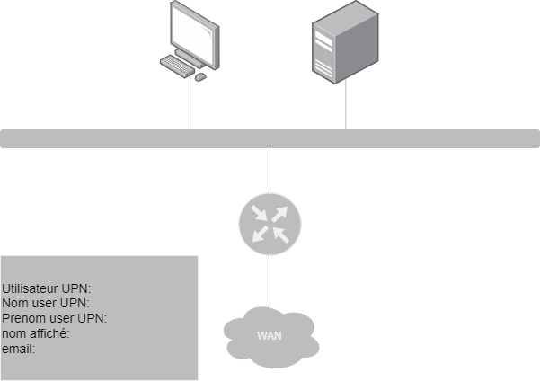
---

#### `Le Schema avec les donées et srvappl_name = false:`  

>  

>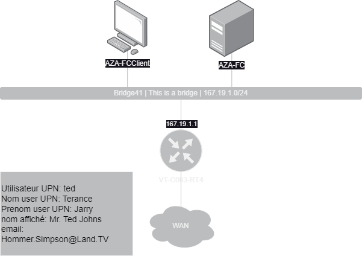
---

#### `Le Schema avec les donées et srvappl_name = false:`  

>  

>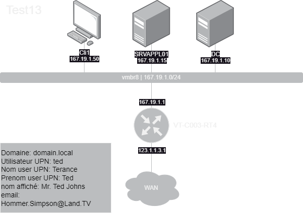

# Fichiers

### script python  
script qui test les valeurs du fichier `.yml`

>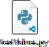

script qui gènere le shema (fichier `apercu.drawio`)

>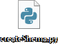

fichier contenant les donées à testet et à ajouter dans le schema  
>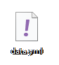

dossier contenant des fichiers `.txt` servant à la génération du schema  
>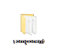
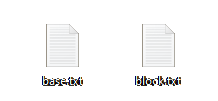
# Fonctionnement

### script 1 (`testValue.py`)

Sur Windows:  
`>> C:\Users\Public\testValue.py`

Sur Ubuntu:  
`>> \home\Public\testValue.py`

Le script va récupèrer les données dans le fichier `*.yml` qui doit être dans le même répértoire que le script et les tester pour voir si elle respectent le format défini.  
Si toutes les donées respéctent leur format alors l'output sera `True` si les données sont fausse l'outbupt sera `False`, en resumé:
`Faux` => `False`  
`Juste` => `True`

On peut aussi le lancer en mode debug, ce qui permet d'avoir le resultat et les données erronées.  
Il faut lui donner le paramètre `-debug`, il n'est pas sensible à la casse, exemple:

 Sur Windows:  
`>> C:\Users\Public\testValue.py -debug`

Sur Ubuntu:  
`>> \home\Public\testValue.py -DeBuG`

l'output sera le suivant:  

>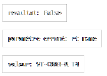  

>

### script 2 (`createShema.py`)

Le script fonctionne avec 1 paramètre qui est le chemin du fichier `.yml`, exemple:

Sur Windows:  
`>> C:\Users\Public\createShema.py C:\Users\Public\aFolder\data.yml`

Sur Ubuntu:  
`>> \home\Public\createShema.py \home\Public\\aFolder\data.yml`

#### Il y a différents messages d'erreur:

 Si le chemin du fichier n'est pas renseigné, exemple:  
`>> C:\Users\Public\createShema.py`  
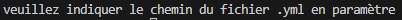  

Si le chemin du fichier n'est pas un fichier `.yml`, exemple:  
`>> C:\Users\Public\createShema.py C:\Users\Public\aFolder\data.txt`   
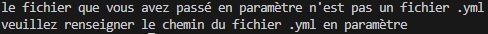

Si le chemin du fichier n'existe pas, exemple:  
`>> C:\Users\Public\createShema.py 5:\Users\Public\aFolder\data.txt`   
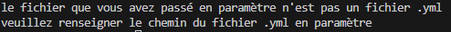

---

Le fichier yml à ce format:  
>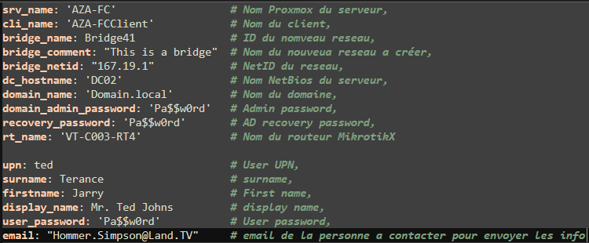

---

Quand tout ça est fini le fichier .drawio est généré et déposé sur le bureau.  
>

# Règles fonctionnement du fichier yml

>`daysuse:` nombre de jour d'utilisation, nombre à 1 ou 2 digits.  
Ex: `1,64,26,92,9,41,76,`
---

>`project_name:` nom du projet, 15 caractères de long (lettres, chiffres, - et .).  
Ex: `SuperProject129, MyProject, 4120, Pr0jEcTaRt`  
---

>`srvappl_name:` nom du serveur aplicatif, 15 caractères de long (lettres, chiffres, - et .).  
Ex: `APServer10, S04, MonAplication, ServerAp5, Tetrice`  
Il est aussi possible de mettre `false` et donc le serveur ne sera pas affiché
---

>`srv_name:` nom du serveur, 15 caractères de long (lettres, chiffres, - et .).  
Ex: `MyServer, SRV39, SB-SRV1, Server, WindowsSrv01`
---

>`cli_name:` nom de la machine client, 15 caractères de long (lettres, chiffres, - et .).     
Ex: `Cli24, MyClient2, Windows11-01, SB-Cli-46`
---

>`bridge_netid:` netId du sous reseau, 1byte.1byte.1byte.   
Ex: `182.10.1, 1.1.1, 90.255.255, 1.2.3, 8.8.8`
---

>`domain_name:` nom de votre domaine, domain.tlc.    
Ex: `myDomain.us, domain.local, google.de, domain.expansion` 
---

>`domain_admin_password:` mot de passe admin, 20 caractères de long.    
Ex: `Password, 1245678, drowssaP, MyPassword, P_s_w_r_` 
---

>`recovery_password:` mot de passe de secour, 20 caractères de long.    
Ex: `Password, 1245678, drowssaP, MyPassword, P_s_w_r_` 
---

>`rt_name:`nom du routeur, 15 caractères de long (lettres, chiffres, - et .).    
Ex: `AB-C007-DE0, PO-K302-AL1, BA-M500-AA0, KF-K392-OP1` 
---

>`upn:` nom de l'utilisateur UPN, 15 caractères de long (lettres, chiffres, - et .).    
Ex: `name, UpnUser, MyUpn, AbCdEfGhIjKlMnO` 
---

>`firstname:` prenom, 15 caractères de long.     
Ex: `Jhon, Axel, Carl,  Linus` 
---

>`surname:` nom, 15 caractères de long.     
Ex: `Cena, Portgas, Marks, Torvald` 
---

>`display_name:` nom affiché de l'utilisateur, 15 caractères de long.     
Ex: `Mister X, SuperUser, Kapata, Atcom ` 
---

>`user_password:` mot de passe de l'utilisateur, 20 caractères de long.      
Ex: `Password, 1245678, drowssaP, MyPassword, P_s_w_r_` 
---

>`email:` email de l'utilisateur, format de mail(XXX@XXX.XXX).   
Ex: `SpongeBob@Ocean.Ki, Albus@bus.sus, Chair@land.TV` 
---

>`bridge_id` id du bridge vmbrX, 1-2 chiffres.
Ex: `1, 5, 10, 58` 
---
 
>`wan_ip` ip du routeur coté WAN, format ip (1byte.1byte.1byte.1byte).   
Ex: `8.8.8.8, 182.103.02.1, 219.12.39.1, 169.254.254.47` 
---