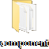
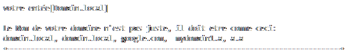

# But
Le but est de créer un simple script qui récupère des données dans un fichier `.yml` et les met sur un schema `drawIo`.  
Le Script peut tourner sur une machine windows 10 et une machine ubuntu 22.xx, avec l'interpreteur python.

#### `Le Schema avant le script :`

---
#### `Le Schema apres le script :`

# Fichiers

script python  

fichier contenant les donées à ajouter dans le schema  

dossier contenant des fichiers `.txt` servant à la génération du schema  

# Fonctionnement

Le script va récupèrer les données dans le fichier `*.yml` qui doit être dans le même répértoire que le script.  

Si le script ne trouve pas de fichier `*.yml` il va afficher ce message d'erreur :  

---

Le fichier yml à ce format:  

---

Le script verifier les donées et si elle convienne à des paramètres

Si une des valeurs ne respecte pas les regles un message d'erreur sera affiché:  

Quand tout ça est fini le fichier .drawio est généré et déposé sur le bureau.  
