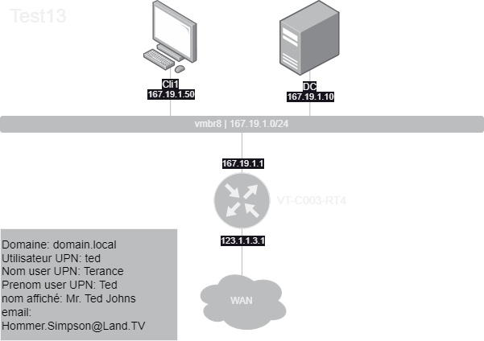
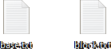
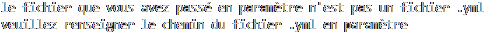
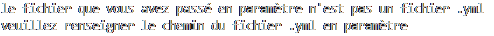
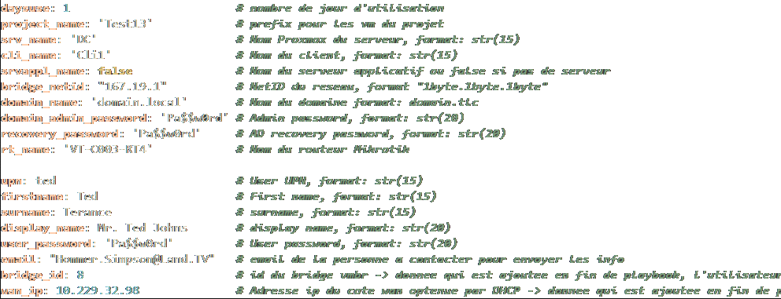

# But
Le but est de créer un simple script qui récupère des données dans un fichier `.yml` et les met sur un schema `drawIo`.  
Le Script peut tourner sur une machine windows 10 et une machine ubuntu 22.xx, avec l'interpreteur python.

#### `Le Schema sans les données :`

---
#### `Le Schema avec les donées :`

# Fichiers

### script python  
script qui test les valeurs du fichier `.yml`

script qui gènere le shema (fichier `apercu.drawio`)

fichier contenant les donées à testet et à ajouter dans le schema  

dossier contenant des fichiers `.txt` servant à la génération du schema  

# Fonctionnement

### script 1 (`testValue.py`)

Le script va récupèrer les données dans le fichier `*.yml` qui doit être dans le même répértoire que le script et les tester pour voir si elle respectent le format défini.  
Si toutes les donées respéctent leur format alors l'output sera `True` si les données sont fausse l'outbupt sera `False`, en resumé:
`Faute` => `False`  
`Juste` => `True`

### script 2 (`createShema.py`)

Le script fonctionne avec 1 paramètre qui est le chemin du fichier `.yml`, exemple:

Sur Windows:  
`>> C:\Users\Public\createShema.py C:\Users\Public\aFolder\data.yml`

Sur Ubuntu:  
`>> \home\Public\createShema.py \home\Public\\aFolder\data.yml`

#### Il y a différents messages d'erreur:

 Si le chemin du fichier n'est pas renseigné, exemple:  
`>> C:\Users\Public\createShema.py`  
  

Si le chemin du fichier n'est pas un fichier `.yml`, exemple:  
`>> C:\Users\Public\createShema.py C:\Users\Public\aFolder\data.txt`   

Si le chemin du fichier n'existe pas, exemple:  
`>> C:\Users\Public\createShema.py 5:\Users\Public\aFolder\data.txt`   

---

Le fichier yml à ce format:  

---

Quand tout ça est fini le fichier .drawio est généré et déposé sur le bureau.  
